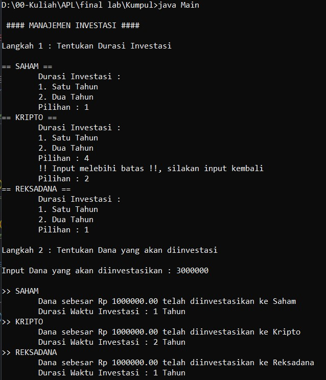

## Muhammad Irfan - 10908107010036
> - Nama panggilan : Irfan
> - Awalan Kasus : I
> - Tema Kasus : Investment

## Deskripsi :
> &emsp;&emsp;Program berikut merupakan program manajemen investasi, dimana seorang investor (orang yang berinvestasi) dapat melakukan investasi ke beberapa instrumen dalam program yang sama .Instrumen investasi yang tersedia berupa Saham, Kripto, dan Reksadana.Seorang investor terlebih dahulu akan menginput durasi investasi untuk setiap instrumen yaitu antara 1 atau 2 tahun, kemudian menginput dana yang ingin diinvestasikan. Dana tersebut selanjutnya akan dibagi rata ke setiap instrumennnya.

## Penerapan Observer Pattern :

> - Subject : Investor
> - Observer : Saham, Reksadana, Kripto
> - Package/Folder : Instrumen

>  &emsp;&emsp;Untuk setiap investasi yang dilakukan maka tiap instrumen akan menerima pemberitahuan saat ada dana yang masuk. Implementasi Observer terdapat pada `main.java`

## Penerapan Decorator Pattern :
> - Decorator : SatuTahunDecorator, DuaTahunDecorator
> - Package/Folder : DurasiInvestasi

> &emsp;&emsp;Untuk setiap instrumen, tersedia pilihan durasi investasi yaitu 1 tahun atau 2 tahun. Durasi ini diterapkan melalui decorator yaitu SatuTahunDecorator dan DuaTahunDecorator. Implementasi decorator tidak dibuat di `main.java` namun, terdapat pada file `investor.java` agar file main lebih clean.

## Output :

